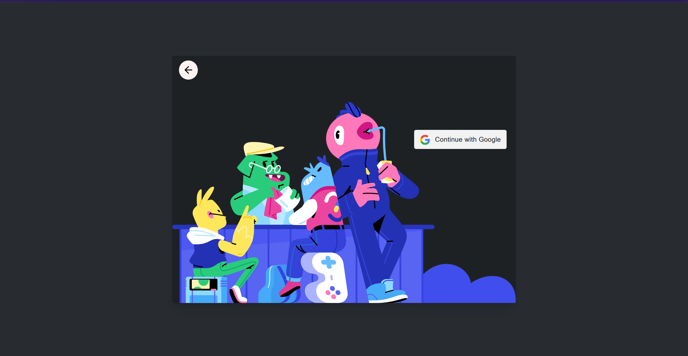
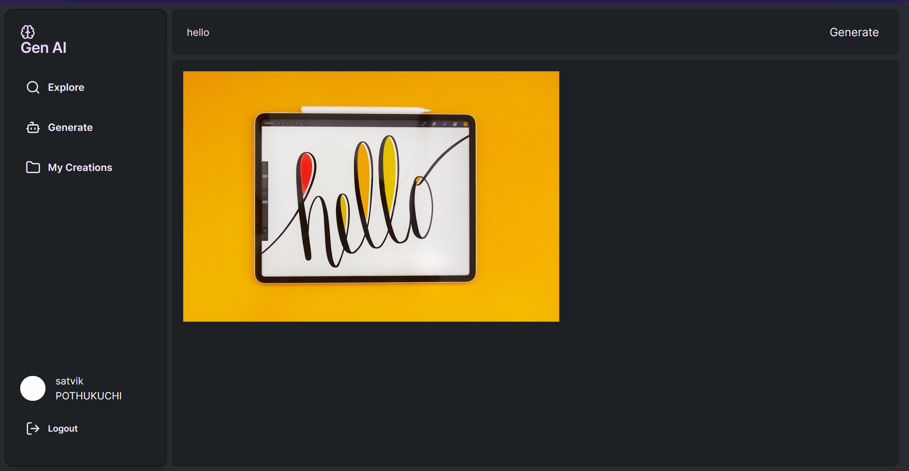
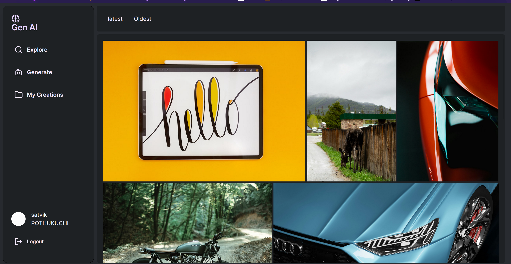
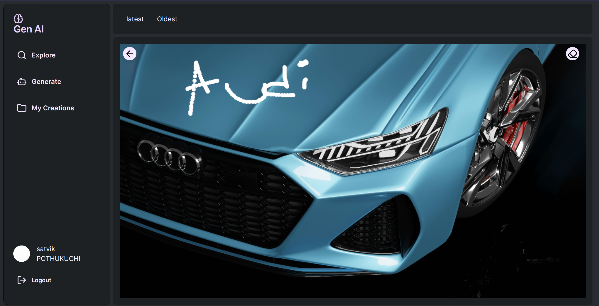

This is a [Next.js](https://nextjs.org/) project bootstrapped with [`create-next-app`](https://github.com/vercel/next.js/tree/canary/packages/create-next-app).

## Getting Started

First, run the development server:

```bash
npm run dev
# or
yarn dev
# or
pnpm dev
# or
bun dev
```

Open [http://localhost:3000](http://localhost:3000) with your browser to see the result.

Navigating through the website 
STEP 1 Login:

after successful login you will be redirected to explore page


STEP 2 Generate Image:


You can view images generated by you in 'My Creations'


You can draw on images generated by you by selecting one of the images.
